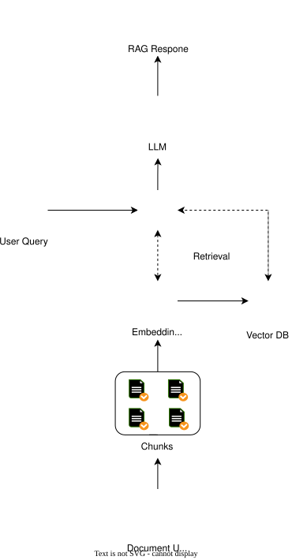

# ozbot

A RAG chatbot that actually knows what you're talking about. Upload a PDF, ask questions about it, and get answers that make sense instead of hallucinations.

## project plan

still working on a few things:

- [ ] Authentication (user login/signup)
- [ ] Dynamic document upload (no more manually setting FILE_PATH)
- [ ] Frontend integration (actual UI instead of CLI)

## getting started

### you'll need:

- [Bun](https://bun.sh) (way faster than Node, trust me)
- A Pinecone account for vector storage
- API keys for:
  - **Groq** (for the LLM)
  - **Pinecone** (for vector database)

### setup

Clone this thing and install deps:

```bash
bun install
```

Create a `.env` file with your API keys:

```
GROQ_API_KEY=your_groq_key_here
JINA_API_KEY=your_jina_key_here
PINECONE_INDEX_NAME=your_index_name
FILE_PATH=/path/to/your/pdf.pdf
```

## how to use it

### 1. Index a PDF

```bash
bun run rag.js
```

This reads your PDF, splits it into chunks, embeds them with Jina, and stores them in Pinecone. Do this once per document (or whenever you want to update it).

### 2. Chat with your document

```bash
bun run chat.js
```

Then just start typing your questions. Type `exit` or `bye` to quit.

```
You: What's the main point of chapter 3?
[bot gives you an answer based on actual content]
```

## how it works under the hood

Here's how the magic happens (or at least the architecture behind it):



1. **PDF Loading** (`prepare.js`) - Reads PDF files
2. **Text Splitting** - Breaks documents into 500-char chunks (overlapping by 100 chars so context doesn't get cut off)
3. **Embeddings** - Uses Jina to convert chunks into vectors
4. **Vector Storage** - Stores everything in Pinecone
5. **Similarity Search** - When you ask a question, finds the 3 most relevant chunks
6. **LLM Response** - Sends those chunks + your question to Groq, gets back a coherent answer

## dependencies

- **LangChain** - The RAG orchestration stuff
- **Pinecone** - Vector database
- **Groq SDK** - LLM provider
- **Jina** - Embeddings model
- **pdf-parse** - Extracts text from PDFs
- **Bun** - Runtime (obviously)

## notes

- The system prompt is pretty basic right now. Feel free to customize it in `chat.js` if you want it to act differently.
- Similarity search pulls the top 3 chunks. Adjust that number if you want more or less context.
- Chunk size is 500 chars with 100 char overlap. Tweak these in `prepare.js` if documents aren't chunking well.

---

built with Bun, Groq, and frustration with bad search tools
